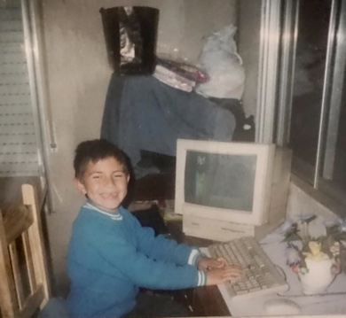

Soy Fernando, vivo en Barcelona 🌊, actualmente formo parte del equipo de ingenieria de [ioBuilders](https://io.builders) como Product Engineer.

Me apasiona el aprendizaje continuo, enfrentar nuevos desafíos y compartir el conocimiento que adquiero a lo largo de mi carrera. Con más de 3 años de experiencia profesional, he diseñado y construido software tanto en Frontend como en Backend.

En el lado del Backend, manejo tecnologías como Java, Groovy y Node.js, mientras que en Frontend trabajo con JavaScript, TypeScript, React y React Native. Además, tengo amplia experiencia escribiendo pruebas automatizadas y unitarias utilizando herramientas como Spock, Jest, Testing Library y K6 para pruebas de rendimiento.

En cuanto a infraestructura, he trabajado con Amazon AWS, ArgoCD, Grafana, Docker y Kubernetes, gestionando entornos escalables y bien monitoreados. Utilizo PostgreSQL como base de datos y manejo colas de mensajería como RabbitMQ. Además, gestiono el control de versiones con Git.

He participado en el desarrollo de múltiples servicios basados en arquitectura hexagonal y DDD, desde su concepción hasta su despliegue en producción, supervisando su correcto funcionamiento y actuando rápidamente en caso de ser necesario.

Gracias por tomarte el tiempo para leer, ¡espero que conectemos pronto!

[Enviame un correo 📮](mailto:fervaldezjr11@gmail.com)
